# Todo Application - Architecture Diagrams

## System Architecture Overview

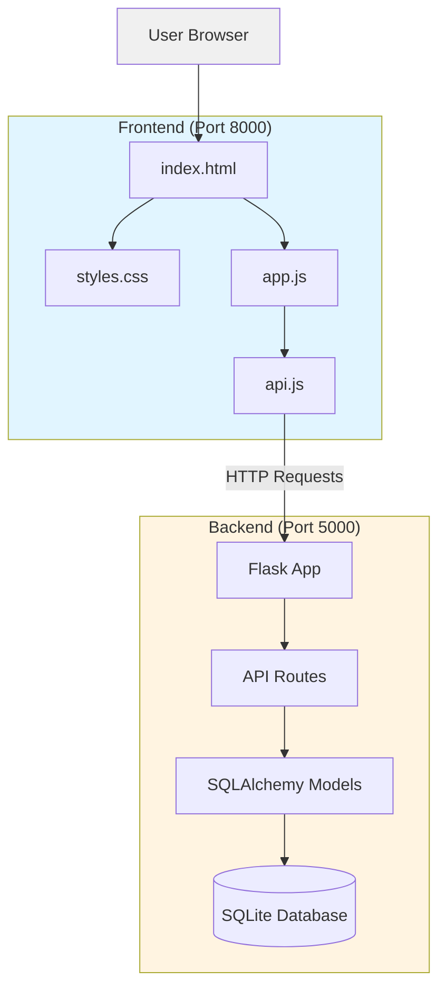

## Request Flow Diagram

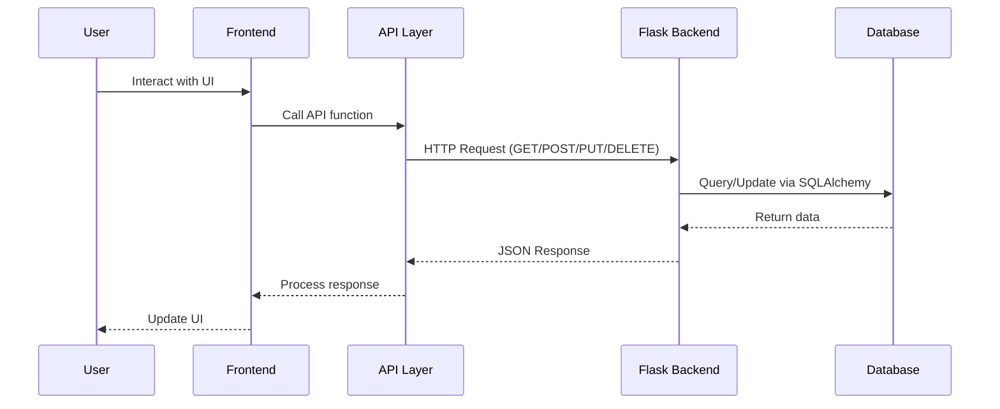

## Database Schema

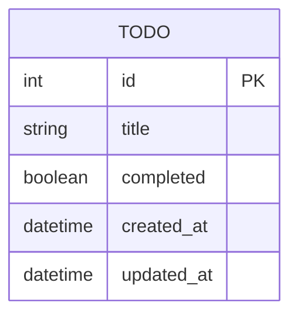

## API Endpoint Structure

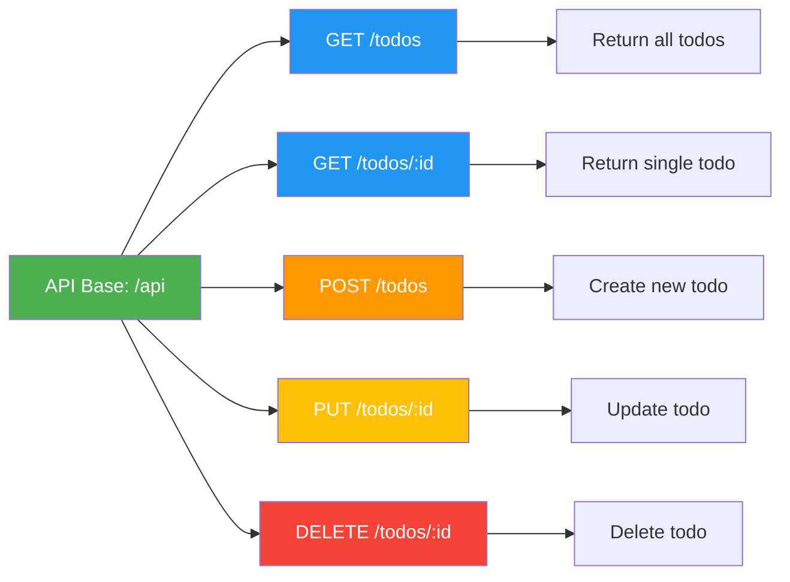

## Frontend Component Structure

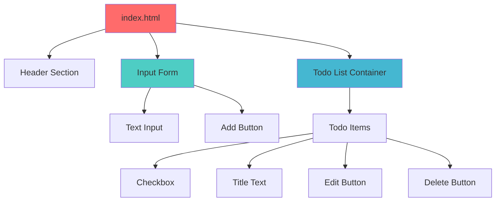

## Backend Component Structure

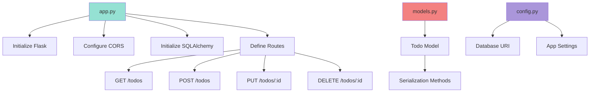

## Data Flow for Creating a Todo

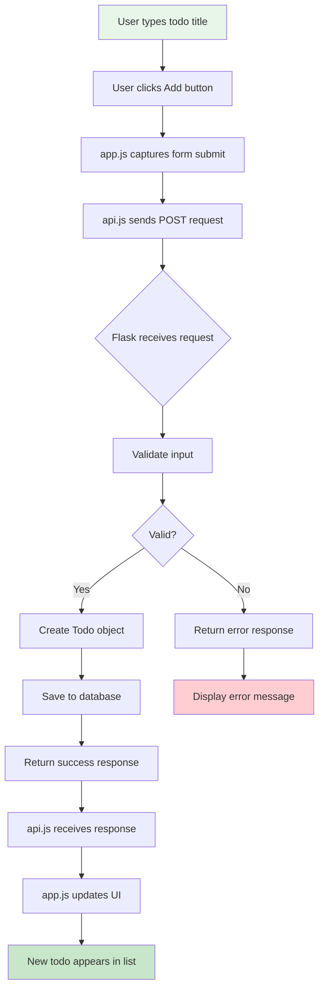

## File Organization

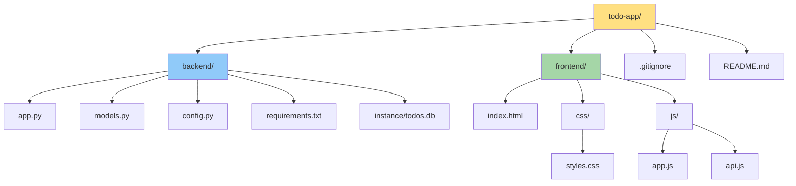

## Technology Stack Layers

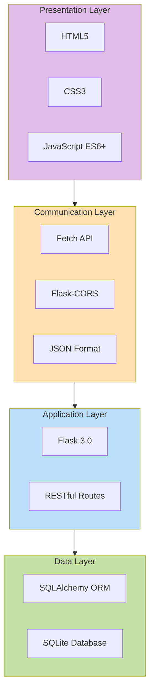

## Development Workflow

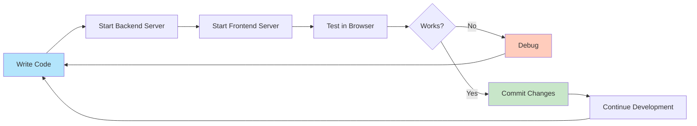

## Deployment Architecture (Future)

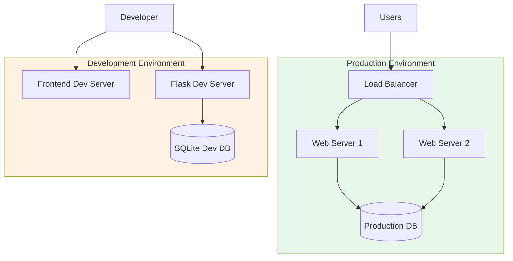

---

## Key Architectural Decisions

### 1. Separation of Concerns
- **Frontend**: Handles UI/UX and user interactions
- **Backend**: Manages business logic and data persistence
- **API Layer**: Clean interface between frontend and backend

### 2. RESTful API Design
- Standard HTTP methods (GET, POST, PUT, DELETE)
- Resource-based URLs
- JSON data format
- Stateless communication

### 3. Database Choice
- SQLite for simplicity and zero configuration
- SQLAlchemy ORM for database abstraction
- Easy migration to PostgreSQL/MySQL if needed

### 4. Frontend Architecture
- Vanilla JavaScript for simplicity
- Modular code organization (api.js, app.js)
- Separation of concerns (HTML, CSS, JS)

### 5. Development Approach
- Start simple, iterate quickly
- Clear API contracts
- Easy local development setup
- Version control ready

---

## Security Considerations

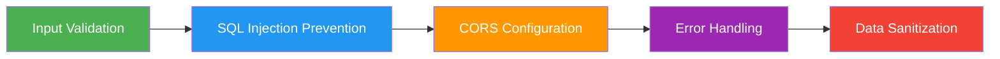

### Implemented Security Measures
1. **SQLAlchemy ORM** - Prevents SQL injection
2. **Input Validation** - Server-side validation of todo titles
3. **CORS Configuration** - Controlled cross-origin access
4. **Error Handling** - Graceful error responses without exposing internals

---

## Performance Considerations

- **Database Indexing**: Primary key on id column
- **Efficient Queries**: SQLAlchemy optimized queries
- **Minimal Dependencies**: Fast load times
- **Caching Strategy**: Browser caching for static assets

---

This architecture provides a solid foundation for a simple, maintainable todo application that can be easily extended in the future.